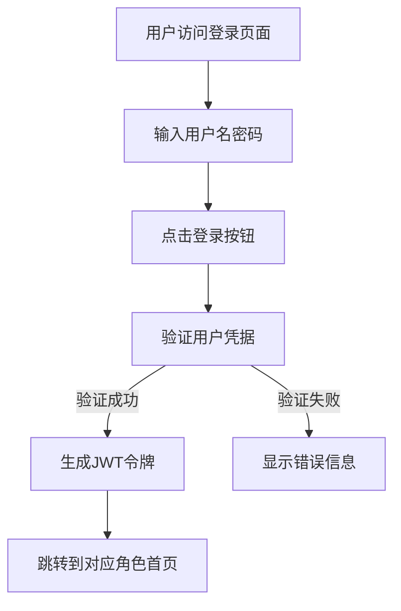
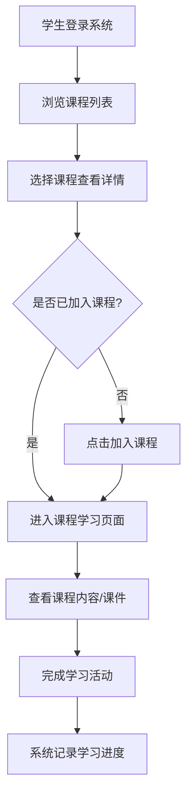
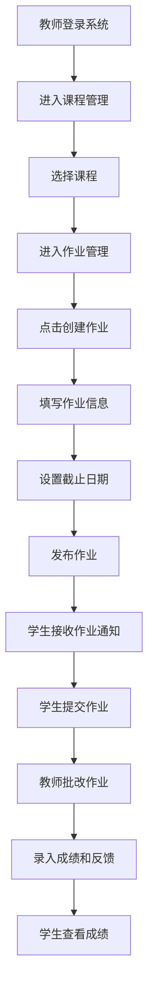
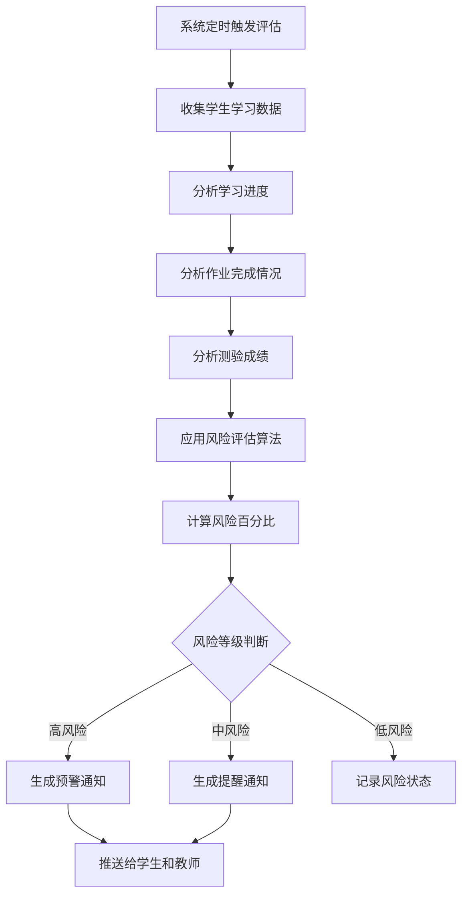

# 个性化学习路径的在线课程管理系统需求分析

## 一、用例

### 1.1 学生用户

| 用例名称     | 功能描述               | 权限要求         |
| ------------ | ---------------------- | ---------------- |
| 用户登录     | 学生账号登录系统       | 所有学生         |
| 课程浏览     | 浏览可选课程列表       | 所有学生         |
| 课程加入     | 加入感兴趣的课程       | 所有学生         |
| 课程学习     | 查看课程内容、课件     | 已加入课程的学生 |
| 作业提交     | 提交课程作业           | 已加入课程的学生 |
| 成绩查看     | 查看课程成绩和评分     | 已加入课程的学生 |
| 学习进度管理 | 查看个人学习进度       | 所有学生         |
| 学习路径查看 | 查看个性化学习路径推荐 | 所有学生         |
| 风险预警查看 | 查看个人学习风险评估   | 所有学生         |
| 智能答疑     | 与智能机器人交流问答   | 所有学生         |
| 消息接收     | 接收系统通知和课程消息 | 所有学生         |

### 1.2 教师用户

| 用例名称     | 功能描述             | 权限要求   |
| ------------ | -------------------- | ---------- |
| 用户登录     | 教师账号登录系统     | 所有教师   |
| 课程管理     | 创建、编辑、删除课程 | 所有教师   |
| 学生管理     | 查看课程内学生列表   | 该课程教师 |
| 作业发布     | 发布课程作业         | 该课程教师 |
| 作业批改     | 批改学生提交的作业   | 该课程教师 |
| 成绩录入     | 录入和更新学生成绩   | 该课程教师 |
| 学习风险查看 | 查看班级学习风险统计 | 所有教师   |
| 学习进度统计 | 查看班级学习进度统计 | 所有教师   |
| 消息发送     | 发送课程通知和公告   | 所有教师   |

### 1.3 管理员用户

| 用例名称 | 功能描述                 | 权限要求   |
| -------- | ------------------------ | ---------- |
| 用户登录 | 管理员账号登录系统       | 所有管理员 |
| 用户管理 | 创建、编辑、删除用户账号 | 所有管理员 |
| 角色管理 | 管理用户角色和权限       | 所有管理员 |
| 系统配置 | 配置系统参数和设置       | 所有管理员 |
| 数据监控 | 监控系统运行数据         | 所有管理员 |
| 日志查看 | 查看系统操作日志         | 所有管理员 |

### 1.4 系统功能（自动化）

| 用例名称     | 功能描述                       | 触发条件                 |
| ------------ | ------------------------------ | ------------------------ |
| 学习路径推荐 | 基于学生数据推荐个性化学习路径 | 定时触发或学习数据更新时 |
| 学习风险预测 | 预测学生学习风险并生成预警     | 定时触发或学习进度更新时 |
| 智能答疑响应 | 接收学生问题并自动回答         | 学生发送问题时           |
| 缓存管理     | 管理系统数据缓存               | 数据更新时               |
| 消息队列处理 | 异步处理系统消息               | 消息生成时               |

## 二、架构

### 2.1 微服务架构
- 前后端分离架构
- 模块化设计，支持服务独立部署和扩展
- RESTful API 接口规范

### 2.2 缓存系统
- 使用 Redis 作为缓存数据库
- 对频繁访问的数据进行缓存
- 缓存策略：查询缓存、修改清除
- 缓存键设计：业务模块+ID命名方式

### 2.3 认证与授权
- 基于 JWT 的认证机制
- 角色基础的访问控制（RBAC）
- 用户会话管理

### 2.4 消息系统
- 使用 RabbitMQ 实现异步消息处理
- 支持发布订阅模式
- 应用场景：用户通知、数据同步、异步任务

### 2.5 定时任务
- 学习路径推荐计算
- 学习风险预测评估
- 系统数据统计和报告生成

## 三、业务的执行流程

### 3.1 用户登录流程

### 3.2 学生课程学习流程

### 3.3 教师作业管理流程

### 3.4 学习风险评估流程

## 四、接口说明

### 4.1 用户管理接口

| 接口名       | 接口路径         | 方法   | 参数说明                         | 功能描述           |
| ------------ | ---------------- | ------ | -------------------------------- | ------------------ |
| 用户登录     | /api/users/login | POST   | username:用户名 password:密码 | 用户身份验证       |
| 获取用户信息 | /api/users/{id}  | GET    | id:用户ID                        | 根据ID查询用户信息 |
| 获取用户列表 | /api/users       | GET    | 无                               | 获取所有用户列表   |
| 创建用户     | /api/users       | POST   | User对象                         | 创建新用户         |
| 更新用户     | /api/users/{id}  | PUT    | id:用户ID User对象            | 更新用户信息       |
| 删除用户     | /api/users/{id}  | DELETE | id:用户ID                        | 删除用户           |

### 4.2 课程管理接口

| 接口名         | 接口路径                         | 方法   | 参数说明                            | 功能描述           |
| -------------- | -------------------------------- | ------ | ----------------------------------- | ------------------ |
| 获取课程信息   | /api/courses/{id}                | GET    | id:课程ID                           | 根据ID查询课程信息 |
| 获取课程列表   | /api/courses                     | GET    | 无                                  | 获取所有课程列表   |
| 按教师获取课程 | /api/courses/teacher/{teacherId} | GET    | teacherId:教师ID                    | 获取指定教师的课程 |
| 按学生获取课程 | /api/courses/student/{studentId} | GET    | studentId:学生ID                    | 获取学生已选课程   |
| 创建课程       | /api/courses                     | POST   | Course对象                          | 创建新课程         |
| 更新课程       | /api/courses/{id}                | PUT    | id:课程ID Course对象             | 更新课程信息       |
| 删除课程       | /api/courses/{id}                | DELETE | id:课程ID                           | 删除课程           |
| 学生加入课程   | /api/courses/{courseId}/join     | POST   | courseId:课程ID studentId:学生ID | 学生加入指定课程   |

### 4.3 作业管理接口

| 接口名         | 接口路径                                       | 方法   | 参数说明                    | 功能描述           |
| -------------- | ---------------------------------------------- | ------ | --------------------------- | ------------------ |
| 获取作业信息   | /api/assignments/{id}                          | GET    | id:作业ID                   | 根据ID查询作业信息 |
| 获取课程作业   | /api/assignments/course/{courseId}             | GET    | courseId:课程ID             | 获取课程的所有作业 |
| 获取待提交作业 | /api/assignments/student/{studentId}/pending   | GET    | studentId:学生ID            | 获取学生待提交作业 |
| 获取已提交作业 | /api/assignments/student/{studentId}/submitted | GET    | studentId:学生ID            | 获取学生已提交作业 |
| 创建作业       | /api/assignments                               | POST   | Assignment对象              | 创建新作业         |
| 更新作业       | /api/assignments/{id}                          | PUT    | id:作业ID Assignment对象 | 更新作业信息       |
| 删除作业       | /api/assignments/{id}                          | DELETE | id:作业ID                   | 删除作业           |

### 4.4 学习风险接口

| 接口名       | 接口路径                         | 方法 | 参数说明         | 功能描述               |
| ------------ | -------------------------------- | ---- | ---------------- | ---------------------- |
| 获取风险评估 | /api/risks/{id}                  | GET  | id:风险ID        | 根据ID查询风险评估     |
| 获取学生风险 | /api/risks/student/{studentId}   | GET  | studentId:学生ID | 获取学生的所有风险评估 |
| 获取课程风险 | /api/risks/course/{courseId}     | GET  | courseId:课程ID  | 获取课程的所有风险评估 |
| 获取风险统计 | /api/risks/statistics/{courseId} | GET  | courseId:课程ID  | 获取课程风险统计数据   |
| 批量评估风险 | /api/risks/evaluate/{courseId}   | POST | courseId:课程ID  | 批量评估课程内学生风险 |

### 4.5 机器学习服务接口

| 接口名       | 接口路径                       | 方法 | 参数说明                            | 功能描述           |
| ------------ | ------------------------------ | ---- | ----------------------------------- | ------------------ |
| 获取学习路径 | /api/learning-path/{studentId} | GET  | studentId:学生ID                    | 获取个性化学习路径 |
| 智能问答     | /api/chatbot/query             | POST | query:问题内容                      | 智能答疑服务       |
| 评估学习风险 | /api/ai/evaluate-risk          | POST | studentId:学生ID courseId:课程ID | 评估学生学习风险   |

## 五、数据模型

### 5.1 用户表（User）
- id：主键ID
- username：用户名
- password：密码
- name：真实姓名
- email：邮箱
- phone：电话号码
- role：角色（student/teacher/admin）
- status：状态
- created_at：创建时间
- updated_at：更新时间
- last_login：最后登录时间

### 5.2 课程表（Course）
- id：主键ID
- name：课程名称
- description：课程描述
- teacher_id：教师ID
- credits：学分
- start_date：开始日期
- end_date：结束日期
- status：状态
- created_at：创建时间
- updated_at：更新时间
- difficulty_level：难度等级

### 5.3 作业表（Assignment）
- id：主键ID
- course_id：课程ID
- title：标题
- description：描述
- content：内容
- type：类型
- difficulty：难度
- points：分值
- start_date：开始日期
- deadline：截止日期
- status：状态
- created_at：创建时间
- updated_at：更新时间

### 5.4 成绩表（Grade）
- id：主键ID
- student_id：学生ID
- course_id：课程ID
- assignment_id：作业ID
- score：分数
- max_score：满分
- feedback：反馈
- submission_time：提交时间
- status：状态
- created_at：创建时间
- updated_at：更新时间

### 5.5 学习进度表（LearningProgress）
- id：主键ID
- student_id：学生ID
- course_id：课程ID
- progress_percentage：进度百分比
- last_study_time：最后学习时间
- total_study_hours：总学习时长
- status：状态
- created_at：创建时间
- updated_at：更新时间

### 5.6 学习风险表（LearningRisk）
- id：主键ID
- student_id：学生ID
- course_id：课程ID
- risk_percentage：风险百分比
- risk_level：风险等级
- reason：风险原因
- recommendations：推荐建议
- is_processed：是否已处理
- created_at：创建时间
- updated_at：更新时间

## 六、非功能性需求

### 6.1 性能要求
- 系统响应时间不超过2秒
- 支持至少1000个并发用户
- 数据库查询优化，减少响应时间
- 合理使用缓存机制，提高访问速度

### 6.2 可用性要求
- 系统可用性达到99.9%
- 定期数据备份策略
- 故障恢复机制
- 负载均衡支持

### 6.3 安全性要求
- 用户认证和授权机制
- 数据加密存储
- 防止SQL注入、XSS攻击等安全威胁
- 敏感数据保护

### 6.4 可扩展性要求
- 模块化设计，便于功能扩展
- 支持水平扩展
- 兼容第三方系统集成
- 插件式架构设计

### 6.5 兼容性要求
- 支持主流浏览器（Chrome、Firefox、Safari、Edge）
- 响应式设计，支持PC端和移动端
- 支持不同分辨率显示
        
